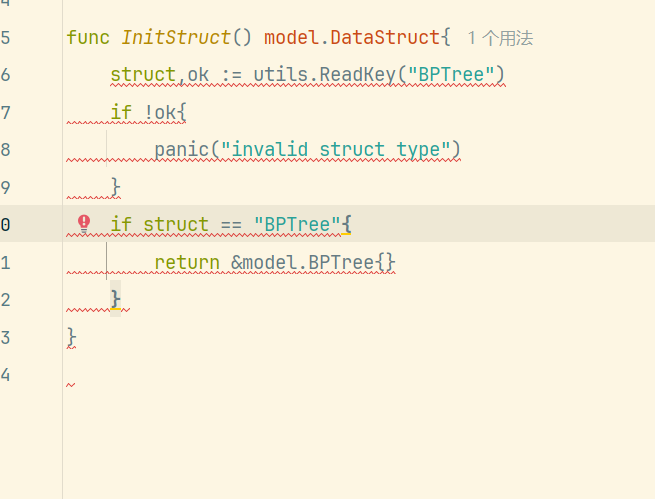
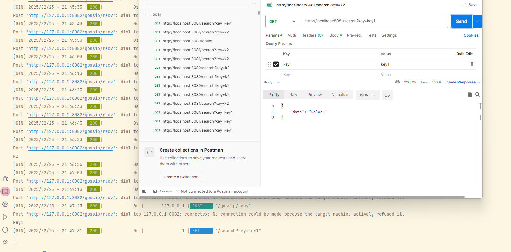
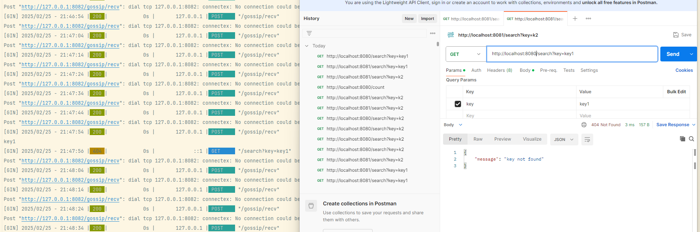
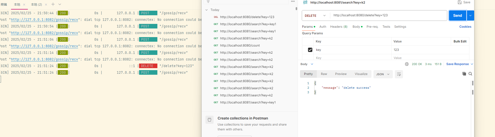
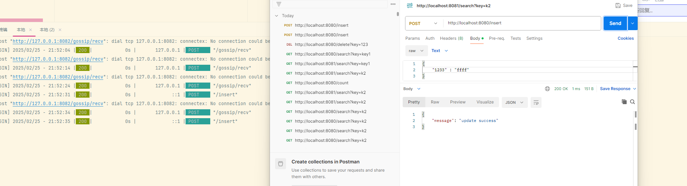
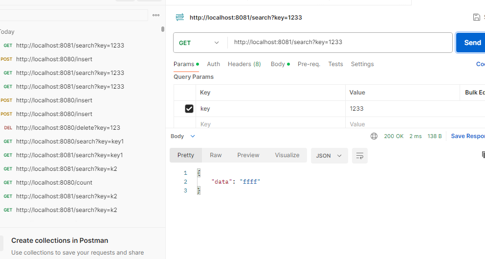

使用gin框架做的分布式内存数据库，存放k-v类型数据
其中数据结构使用B+树和go本身map类型，默认类型是B+
使用锁机制保证数据安全，数据结构中每个存储数据的节点都有读写锁，保证并发安全
使用gossip协议模式同步数据，gossip更新数据时，全局锁上写锁，其他操作堵塞
使用惰性删除策略，访问key时发送key到检测过期的chan里，执行过期删除逻辑

启动

访问8081数据，过期时间设置五秒，访问8080时key已经过期被删除

删除数据

更新数据

gossip同步数据
